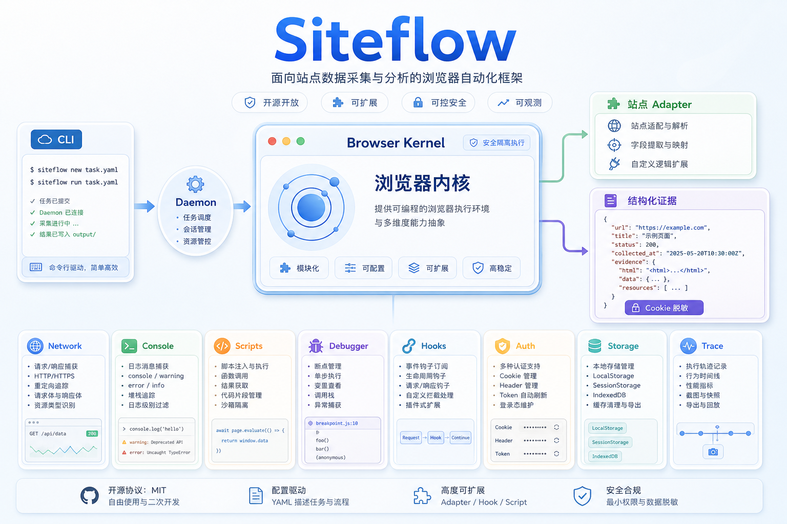
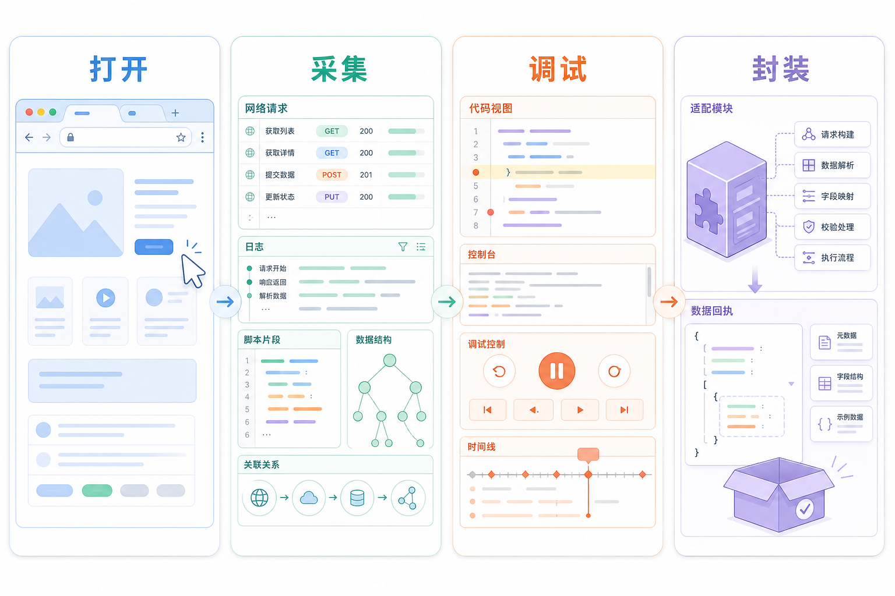
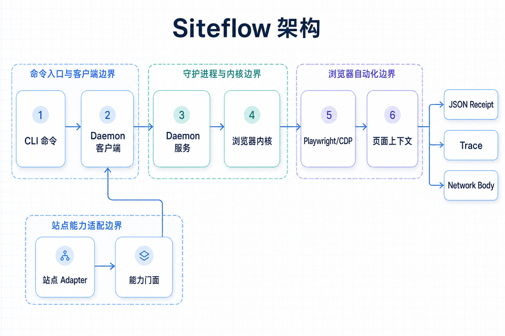
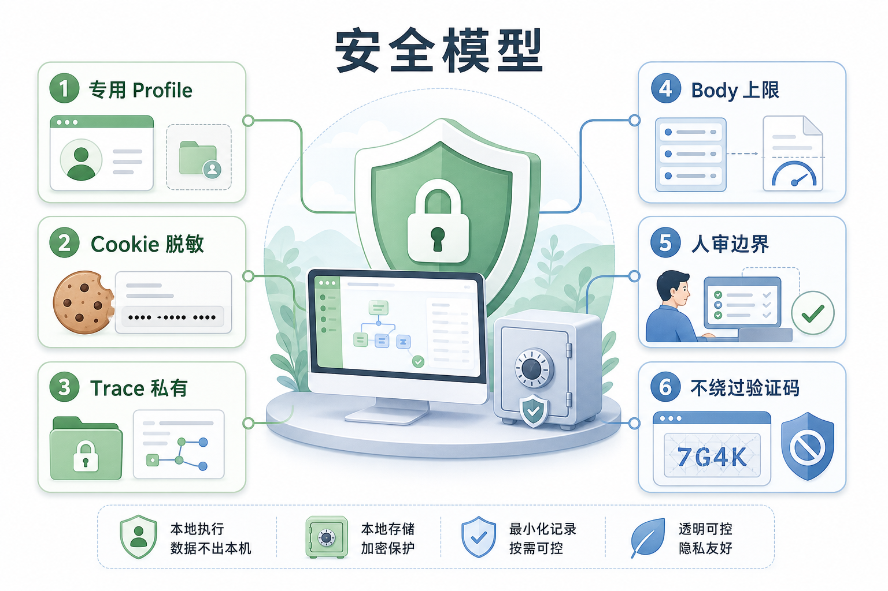

# Siteflow

<p align="center">
  
</p>

<p align="center">
  <strong>由本地 Browser Kernel 驱动的可复用站点工作流平台。</strong>
</p>

<p align="center">
  <code>siteflow</code> 把重复的网站操作沉淀成稳定 CLI 工作流，并保留可复查的浏览器证据、隔离 profile 和结构化 receipt。
</p>

<p align="center">
  <a href="#快速开始">快速开始</a> ·
  <a href="#为什么需要-siteflow">为什么需要 Siteflow</a> ·
  <a href="#架构">架构</a> ·
  <a href="#站点-adapter">站点 Adapter</a> ·
  <a href="#安全模型">安全模型</a>
</p>

---

## 为什么需要 Siteflow

很多浏览器自动化一开始都是一次性脚本：打开页面、看一个请求、复制一段 cookie、重放一次接口，然后过几天就没人记得当时怎么跑通的。

Siteflow 解决的是这个问题：

> 把一次性的网页分析过程，变成可复用、可验证、可交给 agent 执行的站点工作流。

它在本地启动一个 daemon-backed browser，让多个短命令共享同一个浏览器上下文。你可以连续观察页面、脚本、console、network、storage、cookie、debugger 状态，再把稳定路径封装成站点 adapter。

<p align="center">
  
</p>

Siteflow 适合这些场景：

- 让 CLI 多次命令共享同一个浏览器会话；
- 调试页面脚本、console、network、storage、cookie、CDP debugger；
- 把已知网站流程封装成可复用站点 adapter；
- 为 agent、测试或排障系统产出结构化 JSON receipt；
- 在发布、生成、下载、登录态、风控挑战等场景停在人审边界，而不是盲目执行危险动作。

## 快速开始

从 npm 安装：

```bash
npm install -g siteflow-cli
siteflow --help
siteflow --json doctor
```

从源码运行：

```bash
npm install
npm run build
npm link
```

确认本地命令可用：

```bash
siteflow --help
siteflow --json doctor
```

启动本地 browser daemon：

```bash
siteflow --json daemon start
siteflow --json browser open https://example.com
siteflow --json browser pages
```

查看浏览器证据：

```bash
siteflow --json scripts list
siteflow --json console list --limit 20
siteflow --json network list --limit 50
siteflow --json runtime storage
```

执行站点 adapter：

```bash
siteflow --json sites list
siteflow --json x home --pages 1
siteflow --json github trending --limit 5
siteflow --json youtube search AI --limit 5
```

停止 daemon：

```bash
siteflow --json daemon stop
```

## 架构

<p align="center">
  
</p>

Siteflow 分成两层。

### 1. Browser Kernel

Browser Kernel 是底层通用浏览器执行层，负责真实浏览器生命周期和 CDP 状态。

它管理：

- Playwright browser context；
- 页面打开、选择、导航、截图、点击、输入、上传、select；
- scripts list/search/source；
- console capture；
- network request/response metadata 和 body retention；
- debugger breakpoint、paused frame eval、step/resume；
- fetch / XHR / WebCrypto hooks；
- cookie export/import/redaction；
- storage/state save/load；
- failure receipt 和 trace artifact。

核心文件：

```text
src/runtime/browser-runtime.ts          facade/coordinator
src/runtime/browser-session.ts          launch / attach / context lifecycle
src/runtime/browser-kernel-context.ts   page ownership and selected page state
src/runtime/network-recorder.ts         request/response metadata and body retention
src/runtime/debugger-runtime.ts         breakpoints, paused eval, step/resume
src/runtime/auth-store.ts               cookie export/import/redaction
src/runtime/page-actions.ts             click/type/select/upload/screenshot
```

### 2. Site Adapter Layer

站点 adapter 是建立在 Browser Kernel 上的可复用工作流。

adapter 不直接持有浏览器状态，也不直接 import daemon client。它们统一通过 `src/sites/capabilities.ts` 使用底层能力。

```text
site adapter
  -> src/sites/capabilities.ts
    -> daemon client
      -> Browser Kernel
```

这个边界很重要：

- adapter 保持小而清晰；
- cookie、trace、redaction、错误处理走统一路径；
- 不同站点不会各自发明一套 daemon/browser 访问方式；
- 后续新增站点可以复用同一套能力模型。

## 站点 Adapter

Siteflow 内置了一批站点 adapter，覆盖读取、采集、媒体检查、creator center 状态观察和人审草稿流程。

| Adapter | 能力 |
| --- | --- |
| `x` / `twitter` | X/Twitter timeline、profile、tweet、media、visible-page collection |
| `xhs` | 小红书 creator draft 自动化，不点击最终发布 |
| `douyin` | 抖音创作者中心状态观察和发布辅助 |
| `suno` | Suno 状态观察和音乐生成 handoff，识别 captcha 状态 |
| `jimeng` | 即梦生成工作流观察 |
| `youtube` | YouTube search、video、channel、comments、transcript 提取 |
| ↳ YouTube 使用与业务验证报告 | [docs/youtube-adapter-usage-report.md](./docs/youtube-adapter-usage-report.md) |
| `bilibili` | Bilibili search、video metadata、comments、creator probes |
| `telegram` | 公开频道和本地登录态 chat metadata 工作流 |
| `github` | GitHub trending、repository、release、issue、search probes |
| `reddit` | Reddit subreddit、search、post、comments，带 block detection |
| `xueqiu` | 雪球 market、discussion、status、comment、finance collection |
| `eastmoney` | 东方财富 quote、K-line、money flow、announcements、reports |
| `cninfo` | 巨潮资讯 announcements 和 public PDF collection |
| `sec` | SEC EDGAR company、filing、facts、public filing downloads |
| `arxiv` | arXiv search、paper metadata、latest listings、PDF dry-run planning |
| `1688` | 1688 search 和 product SEO analysis workflows |
| `producthunt` | Product Hunt public page probe，带 challenge detection |
| `rouman5` | rouman5 metadata exploration 和授权下载规划 |
| `media` | direct media 和 unencrypted HLS inspection/download planning |
| `hackernews` | Hacker News listings、stories、comments、public users |

查看当前 adapter：

```bash
siteflow --json sites list
```

每个 adapter 都应该返回结构化 receipt，核心字段包括：

```json
{
  "site": "x",
  "command": "home",
  "ok": true,
  "state": "home_collected",
  "observations": {},
  "errors": [],
  "next": []
}
```

## 浏览器证据原语

Siteflow 的底层命令可以独立使用，也可以被 adapter 组合。

### 页面与脚本

```bash
siteflow --json browser open https://example.com
siteflow --json browser pages
siteflow --json scripts list
siteflow --json scripts search "token"
```

### Console 与 Network

```bash
siteflow --json console list --limit 100
siteflow --json network list --limit 100
siteflow --json network body <id>
siteflow --json request curl <id>
siteflow --json request replay <id>
```

### Workflow Recorder

```bash
siteflow --json recorder start --url https://example.com --out flow.json
# operate the browser manually or through Siteflow browser commands
siteflow --json recorder stop
siteflow --json replay run flow.json
siteflow --json replay export-cli flow.json --out flow.sh
```

Workflow JSON stores replayable intent and lightweight evidence. It does not store cookies, full DOM dumps, or raw network bodies.

Smoke check:

```bash
npm run smoke:recorder
```

### Debugger

```bash
siteflow --json break text SITEFLOW_BREAKPOINT_MARKER --script-url app.js
siteflow --json break xhr /graphql
siteflow --json paused
siteflow --json eval 'value'
siteflow --json resume
```

### Runtime Hooks

```bash
siteflow --json hook fetch
siteflow --json hook xhr
siteflow --json hook crypto
```

### Auth、Storage、State

```bash
siteflow --json auth status
siteflow --json auth cookies --domain example.com
siteflow --json runtime storage
siteflow --json state save --out state.json
```


### Browser Session Import

Import cookies and localStorage from a local Chromium browser profile into the active Siteflow profile:

```bash
siteflow --json auth sources
siteflow --json auth import-browser
siteflow --json auth import-browser --domain x.com
siteflow --json auth import-browser --source chrome:Default --preview
```

`auth import-browser` defaults to importing all supported cookies and localStorage from the detected default Chromium profile. Use `--domain` to narrow scope. Receipts show counts and domains/origins only; cookie values and localStorage values are never printed.

## 安全模型

<p align="center">
  
</p>

Siteflow 的目标不是绕过网站防护，而是在用户授权范围内做可复查的本地自动化。

核心原则：

- **默认使用专用 profile。** 浏览器状态位于 `~/.siteflow/profiles/<profile>/`。
- **Cookie 默认脱敏。** 真实 cookie 只会写入用户显式指定的私有文件。
- **私有 artifact 不进仓库。** network dump、trace export、receipt、screenshots、browser profile 都视为敏感文件。
- **识别挑战，不绕过挑战。** CAPTCHA、Turnstile、Cloudflare、登录页、年龄门槛会被报告为结构化状态。
- **高风险动作停在人审边界。** 发布、生成、下载、草稿等流程必须有显式用户意图，不默认执行不可逆操作。

## 开发

安装和构建：

```bash
npm install
npm run build
```

常用检查：

```bash
npm run typecheck
npm run test:unit
npm run test:coverage
npm run test:coverage:uncovered
```

覆盖率产物会写到 `coverage/`：

- `coverage/summary.md`：人读摘要
- `coverage/summary.json`：机器读摘要
- `coverage/unit-coverage.txt`：Node 原始 coverage 输出
- `coverage/uncovered-lines.md`：按文件列出的未覆盖行
- `coverage/uncovered-lines.json`：未覆盖行机器读结果
- `coverage/raw/`：V8 原始 coverage JSON

只想看“哪些行还没覆盖”时：

```bash
npm run test:coverage:uncovered
```

CI 使用覆盖率门禁：

```bash
npm run test:coverage:ci

本地打包检查：

```bash
npm pack --dry-run
npm run pack:local
```

开源治理文件：

- [贡献指南](./CONTRIBUTING.md)
- [安全政策](./SECURITY.md)
- [Adapter 开发指南](./docs/adapter-authoring.md)
- [脱敏 receipt 示例](./examples/receipts)

当前测试使用 Node 内置 `node:test`，覆盖 Browser Kernel 状态、network retention、debugger eval、auth/cookie、adapter proof 和站点导入边界。

## Adapter 开发规则

新增或修改站点 adapter 时：

1. 站点逻辑放在 `src/sites/<id>.ts`。
2. 在 `src/sites/registry.ts` 注册 adapter。
3. 通过 `src/sites/capabilities.ts` 使用 browser/daemon 能力。
4. 返回结构化 receipt，不要在 adapter 里直接打印或 `process.exit()`。
5. mutating flows 必须显式、可审查，并停在人审边界。
6. 运行 `npm run test:unit`，确保导入边界治理测试通过。

## 环境

- Node.js `>=20.0.0`
- TypeScript ESM
- 默认使用 Playwright Chrome channel
- 可选环境变量：
  - `SITEFLOW_HOME=/tmp/siteflow-test`
  - `SITEFLOW_HEADLESS=true`
  - `SITEFLOW_BROWSER_CHANNEL=chrome`

## 当前状态

Siteflow 已经具备：

- 可工作的 Browser Kernel；
- site capabilities facade；
- 多个内置站点 adapter；
- runtime 关键模块单元测试；
- 面向开源的中文说明和安全边界。

后续重点是：CI、release workflow、更多 adapter-level regression，以及更完整的开源治理文件。
